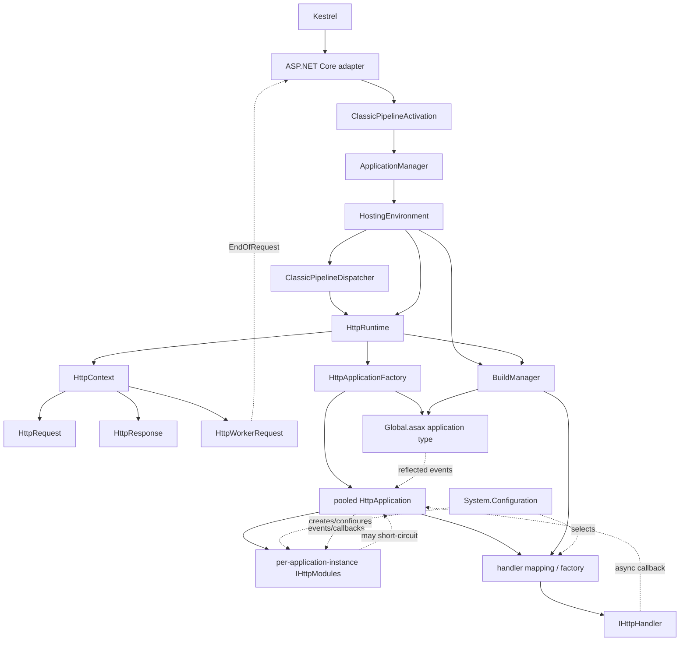

# Classic managed runtime model

This describes the current classic managed path. IIS integrated mode is
background, not a supported runtime profile.

The migrating audience ran integrated mode, so where the two modes diverge in
application-visible behavior the port executes classic and adopts the
integrated-mode observable, decided per site against IIS readings
([ADR 0001](adr/0001-runtime-compatibility-model.md)). Precedents: the
always-integrated `system.webServer` configuration presentation, and the
`Application_Start` failure contract
([ADR 0012](adr/0012-runtime-initiated-restart.md)). Native notification
machinery stays excluded; the managed `UseIntegratedPipeline` divergence is
finite (75 sites in 19 imported files) and auditable — see the backlog.

## Host analogy

| .NET Framework/IIS | Portable host |
| --- | --- |
| IIS receives HTTP | Kestrel receives HTTP |
| `w3wp.exe` hosts CLR | application process hosts modern CLR |
| default AppDomain owns `ApplicationManager` | current AppDomain owns retained `ApplicationManager` |
| `ApplicationManager` creates an application AppDomain | portable leaf creates one current-AppDomain hosting environment |
| ISAPI worker request enters `HttpRuntime.ProcessRequest` | adapter worker request enters the same public method |
| AppDomain unload/recreate | host shutdown and external process replacement |

## Dependency graph

Solid edges are direct ownership/calls. Dotted edges are configuration,
factory, event, or callback dependencies.

## Initialization sequence

1. Host calls `AddRehostWeb` with application options.
2. Static bootstrap validates configuration, binds current-AppDomain identity,
   publishes the IIS baseline, and becomes `Initialized` before listen.
3. `UseRehostWeb` wires host-stop cleanup, registers the forwarded-headers
   middleware (framework trust default; `ASPNETCORE_FORWARDEDHEADERS_ENABLED`
   widens it behind a proxy), and installs terminal middleware.
4. The first routed request evaluates the activation service's thread-safe
   lazy dispatcher; concurrent requests share its result.
5. Activation opens `ApplicationManager` and calls its public `CreateObject`
   with `throwOnError: false`.
6. The retained internal creation path obtains or creates one
   `HostingEnvironment` through the portable current-AppDomain leaf.
7. `HostingEnvironment.Initialize` installs mapped configuration and invokes
   normal `HttpRuntime.HostingInit` and `BuildManager` phases.
8. Hosting creates and registers `ClassicPipelineDispatcher`.
9. The triggering request enters `HttpRuntime.ProcessRequest` through that
   dispatcher.

Startup errors selected by `throwOnError: false`, including application compile
errors, are retained for System.Web to render on requests.

## Request sequence

1. Terminal middleware obtains the shared dispatcher.
2. Adapter validates the supported transport envelope and creates one worker
   request.
3. Dispatcher calls `HttpRuntime.ProcessRequest` directly.
4. `HttpRuntime` applies its normal guard/counter/queue entry.
5. `ProcessRequestInternal` creates `HttpContext`, `HttpRequest`, and
   `HttpResponse`.
6. `EnsureFirstRequestInit` single-flights request-dependent initialization
   using the first real context.
7. `HttpApplicationFactory.GetApplicationInstance` lazily initializes
   `Global.asax` metadata and calls `Application_Start`.
8. Factory takes or creates a pooled `HttpApplication`.
9. A new application instance constructs and initializes configured
   `IHttpModule` instances.
10. `HttpApplication` raises classic pipeline events and selects the configured
    handler/factory.
11. Handler executes synchronously or completes through its async callback.
12. Pipeline unwinds through `EndRequest`; System.Web owns managed failures.
13. `HttpRuntime.FinishRequest` performs final response/error work and calls
    worker-request `EndOfRequest`.
14. Adapter awaits completion, then commits the sealed response spool to
    Kestrel asynchronously.

## Shutdown sequence

`IHostApplicationLifetime.ApplicationStopping` calls activation shutdown once.
If activation never occurred, no runtime shutdown is needed. Otherwise the host
stops the registered dispatcher, requests `HostingEnvironment` shutdown through
`ApplicationManager`, then closes the manager. The dispatcher's `Stop`
unregisters it so hosting shutdown need not wait for its timeout.

Runtime-originated restart/shutdown does not currently notify the ASP.NET Core
host. That is an accepted target in
[ADR 0002](adr/0002-application-lifecycle.md), not current behavior.

## Ownership and lifetime

| Component | Created/initialized by | Owns/calls | Lifetime |
| --- | --- | --- | --- |
| Kestrel/modern CLR | executable host | adapter and process | process |
| static application bootstrap | `AddRehostWeb` | immutable config, AppDomain binding, IIS baseline | process |
| `ClassicPipelineActivation` | host DI registration | lazy dispatcher activation and host-stop cleanup | process |
| `ApplicationManager` | retained static accessor | hosting context and registered-object creation | process/current AppDomain singleton |
| `HostingEnvironment` | `ApplicationManager` portable creation leaf | config installation, registered objects, busy count, shutdown | one application generation |
| `ClassicPipelineDispatcher` | `HostingEnvironment.CreateWellKnownObjectInstance` | `HttpRuntime.ProcessRequest`; unregisters on stop | one application generation |
| `HttpRuntime` | type/static initialization, then `HostingEnvironment` | request entry, first-request state, completion, shutdown requests | one current-AppDomain generation |
| `BuildManager` | `HttpRuntime.HostingInit` | type resolution, generated/top-level compilation | one generation |
| `HttpApplicationFactory` | static/lazy System.Web state | global type/metadata, application pools | one generation |
| normal `HttpApplication` | factory | module instances and request pipeline | pooled across sequential requests; one concurrent request at a time |
| `IHttpModule` instance | each normal `HttpApplication.InitInternal` | subscribes to that application's events | owning pooled application instance |
| `IHttpHandler` | configured handler factory/mapping | request handling | per request or factory-defined reusable instance |
| `HttpContext`, request, response | `HttpRuntime.ProcessRequestInternal` | request state and managed output | one request |
| host worker request | adapter | translation, completion signal, response spool | request through transport commit |

Do not replace module or application pooling with ASP.NET Core singleton/scoped
DI. `HttpRuntime.WebObjectActivator` remains the System.Web activation seam.

## Important lazy and circular dependencies

- `HostingEnvironment` initializes `HttpRuntime`; `HttpRuntime` later calls
  hosting busy-count and shutdown APIs.
- `BuildManager` starts during hosting but performs top-level work lazily.
- `HttpApplicationFactory` compiles/reflects `Global.asax` lazily on the first
  application request.
- Modules and handlers are configuration/factory-created and call back through
  events or async callbacks.
- Worker-request `EndOfRequest` is the transport completion callback.

Preserve retained ordering; isolate platform dependencies at narrow leaves.

## Related contracts

- [Application bootstrap](application-bootstrap-and-configuration.md)
- [Application lifecycle target](adr/0002-application-lifecycle.md)
- [Host boundary target](adr/0003-host-boundary.md)
- [Process lifetime follow-up](follow-ups/process-lifetime-shutdown-and-recycle.md)
- [IIS integrated initialization research](research/aspnet-iis-integrated-initialization-pipeline.md)
