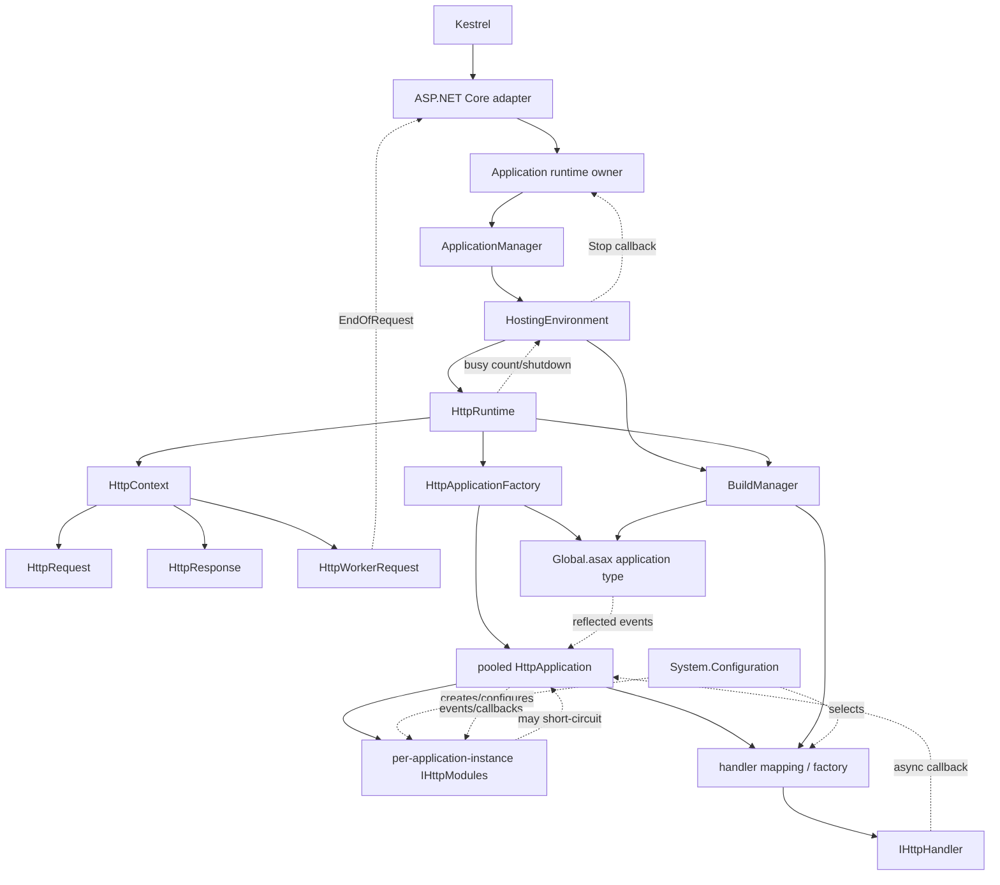

# Classic managed runtime model

Status: accepted planning model. Executable probes remain authoritative.

This document describes only the supported classic managed path and its
portable host analogy. IIS integrated mode is background material, not the
initial contract.

## Host analogy

| .NET Framework/IIS | Portable host |
| --- | --- |
| IIS receives HTTP | Kestrel receives HTTP |
| `w3wp.exe` hosts CLR | application process hosts modern CLR |
| default AppDomain owns `ApplicationManager` | current process/AppDomain owns retained `ApplicationManager` |
| `ApplicationManager` creates application AppDomain | current-AppDomain leaf creates one hosting generation |
| application AppDomain owns `HostingEnvironment`/`HttpRuntime` | process-scoped application owner contains the same managed runtime |
| ISAPI worker request enters `HttpRuntime.ProcessRequest` | Kestrel adapter worker request enters the same public method |
| AppDomain unload/recreate | host stop notification and external process replacement |

## Dependency graph

Solid edges are direct ownership/calls. Dotted edges are configuration,
factory, event, or callback dependencies.

## Initialization sequence

1. Host calls `WebFormsApplication.Create` with explicit immutable inputs.
2. Registration validates identity, roots, baseline assets, work storage, and
   assembly catalog without touching System.Web global state.
3. First routed request enters `ProcessRequestAsync`.
4. The application owner single-flights `Activating`; concurrent requests wait.
5. The immutable application-bin resolver and current-AppDomain binding publish.
6. Owner calls `ApplicationManager.CreateObjectInternal` for the lifecycle
   bridge.
7. `ApplicationManager` locks its application context and obtains/creates one
   `HostingEnvironment`.
8. The portable leaf replaces child-AppDomain creation but retains
   `HostingEnvironment.Initialize`.
9. `HostingEnvironment` installs mapped configuration and establishes its
   application identity/services.
10. `HttpRuntime` static and instance initialization establish callbacks,
    counters/disabled capabilities, and file-monitor state.
11. `HttpRuntime.HostingInit` performs data/access, minimal configuration,
    codegen, trust, configuration completion, process-policy, key, and
    `BuildManager` phases in Framework order.
12. `HostingEnvironment` completes retained post-hosting hooks and creates the
    registered lifecycle bridge.
13. Owner atomically publishes `Accepting`.
14. The triggering real request then enters `HttpRuntime.ProcessRequest`.

Registration is not activation. Activation is not first-request
initialization.

## Request sequence

1. Adapter decides whether the request belongs to Web Forms.
2. Adapter validates the first-slice transport envelope and creates one worker
   request.
3. Application owner activates if still `Registered`.
4. Adapter calls `HttpRuntime.ProcessRequest` directly.
5. `HttpRuntime` applies its normal guard/counter/queue entry.
6. `ProcessRequestInternal` creates `HttpContext`, `HttpRequest`, and
   `HttpResponse`.
7. `EnsureFirstRequestInit` single-flights request-dependent initialization
   using the first real context.
8. `HttpApplicationFactory.GetApplicationInstance` lazily initializes
   `Global.asax` metadata and calls `Application_Start` when that slice exists.
9. Factory takes or creates a pooled `HttpApplication`.
10. A newly created application instance constructs and initializes its
    configured `IHttpModule` instances.
11. `HttpApplication` raises classic pipeline events.
12. Existing configuration-driven mapping/factory code selects the
    `IHttpHandler`.
13. Handler executes synchronously or returns through its async callback.
14. Pipeline unwinds through `EndRequest`; System.Web owns managed failures.
15. `HttpRuntime.FinishRequest` performs final response/error work and calls
    worker-request `EndOfRequest`.
16. Adapter awaits managed completion, then asynchronously commits the sealed
    response spool to Kestrel.

## Ownership and lifetime

| Component | Created/initialized by | Owns/calls | Lifetime |
| --- | --- | --- | --- |
| Kestrel/modern CLR | executable host | adapter and process | process |
| Application runtime owner | host registration | activation, admission, shutdown signal | one per process/generation |
| `ApplicationManager` | retained static accessor | hosting-environment context and lifecycle object creation | process/current AppDomain singleton |
| `HostingEnvironment` | `ApplicationManager` portable creation leaf | config installation, registered objects, busy count, shutdown | one application generation |
| Registered lifecycle bridge | `HostingEnvironment.CreateWellKnownObjectInstance` | relays `Stop` to owner | application generation |
| `HttpRuntime` | type/static initialization, then `HostingEnvironment` | request entry, first-request state, completion, shutdown requests | one per current AppDomain/generation |
| `BuildManager` | `HttpRuntime.HostingInit` | type resolution, generated/top-level compilation | one per generation |
| `HttpApplicationFactory` | static/lazy System.Web state | global type/metadata, application pools | one per generation |
| `Global.asax` type/metadata | `BuildManager` and factory | application events and application state declarations | one compiled type/metadata set per generation |
| special `HttpApplication` | factory | `Application_Start`/`End` and special events | pooled/internal, generation-scoped |
| normal `HttpApplication` | factory | module instances and request pipeline | pooled across sequential requests; one concurrent request at a time |
| `IHttpModule` instance | each normal `HttpApplication.InitInternal` | subscribes to that application's events | same lifetime as owning pooled application instance |
| `IHttpHandler` | configured handler factory/mapping | request handling | per request or factory-defined reusable instance |
| `HttpContext` | `HttpRuntime.ProcessRequestInternal` | request, response, errors, current application | one request |
| `HttpRequest`/`HttpResponse` | `HttpContext` | request interpretation / managed output | one request |
| host worker request | adapter | translation, completion signal, response spool | one request through transport commit |

Do not replace module or application pooling with ASP.NET Core singleton/scoped
DI. Existing `HttpRuntime.WebObjectActivator` remains the explicit System.Web
activation seam.

## Lazy, circular, and indirect dependencies

- `HostingEnvironment` initializes `HttpRuntime`; `HttpRuntime` later calls
  `HostingEnvironment` busy-count and shutdown APIs.
- `HttpRuntime` invokes `HttpApplicationFactory`; the factory and applications
  call back into runtime configuration, `BuildManager`, and static context.
- `BuildManager` is initialized during hosting but performs top-level work
  lazily.
- `HttpApplicationFactory` compiles/reflects `Global.asax` lazily on the first
  application request.
- `HttpApplication` creates modules through configuration/reflection. Modules
  then invoke the application indirectly through subscribed events.
- Handler selection is configuration/factory-driven; async handlers return by
  callback.
- Worker-request `EndOfRequest` is the host completion callback.
- Registered-object `Stop` is the hosting-to-owner shutdown callback.

These cycles are intentional. Preserve their ordering and break platform
dependencies at leaves, not by replacing them with host orchestration.

## Related contracts

- Application state and bootstrap:
  [application bootstrap](application-bootstrap-and-configuration.md) and
  [ADR 0039](adr/0039-use-a-five-state-application-lifecycle.md).
- Failure ownership:
  [ADR 0038](adr/0038-classify-failures-by-ownership-and-mutation.md),
  [ADR 0014](adr/0014-separate-managed-and-adapter-failures.md), and
  [ADR 0016](adr/0016-propagate-only-escaped-request-exceptions.md).
- Restart/shutdown:
  [ADR 0021](adr/0021-use-immutable-application-generations.md),
  [ADR 0027](adr/0027-translate-appdomain-shutdown-to-host-notification.md), and
  [process lifetime](follow-ups/process-lifetime-shutdown-and-recycle.md).

## Evidence anchors

Primary imported sources:

- `Hosting/ApplicationManager.cs`
- `Hosting/HostingEnvironment.cs`
- `HttpRuntime.cs`
- `Compilation/BuildManager.cs`
- `HttpApplicationFactory.cs`
- `HttpApplication.cs`
- `Configuration/HttpModulesSection.cs`
- `ModulesEntry.cs`

Integrated/native background:
[IIS integrated initialization research](research/aspnet-iis-integrated-initialization-pipeline.md).
